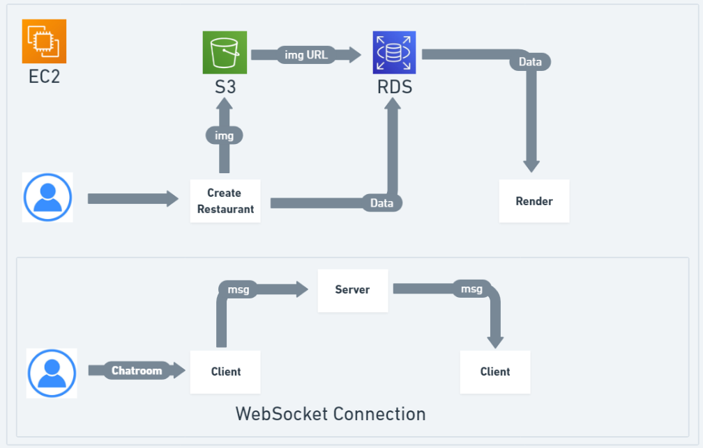
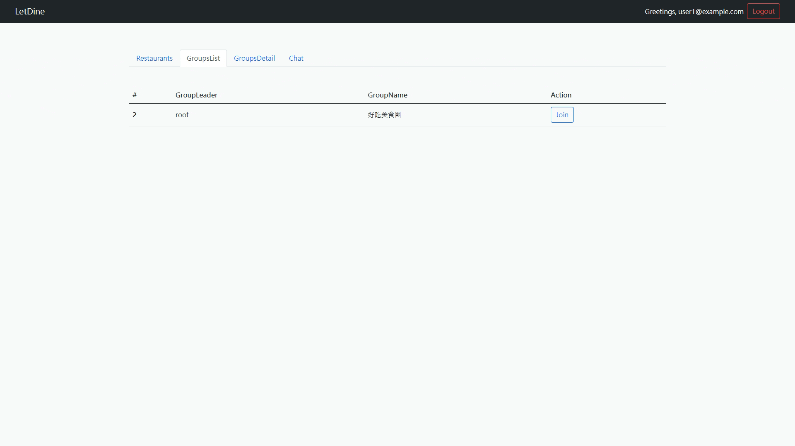

## Introduce

This application is created to facilitate food ordering. Users can create their own dining groups or join others' dining groups. Additionally, they can enter a chat room to chat with everyone or chat with participants in a dining group. Hope you have a pleasant experience!

This website is built with Node.js, Express.js, WebSocket and MySQL. I've leveraged Sequelize, a Node.js ORM (Object Relational Mapping) tool, to interact with the database.The deployment is on AWS EC2, and use S3 for storage and RDS for data management.

## Architecture Diagram



## Demo




## Link
### [Link](http://ec2-35-78-203-246.ap-northeast-1.compute.amazonaws.com:3000/)


## Features

- AWS: S3/EC2/RDS
- WebSocket 
- RESTful API
- CRUD function

Deploy image files to AWS S3 using the code located in the deploy-aws branch at /src/helpers/file-helper.js

## Using in Local
## Installing

1.Clone the repository
```
git clone https://github.com/TheyCallMeAndyBro/LetDine.git
```

2.Move to file
```
cd LetDine
```

3.Install npm packages
```
npm install
```

4.Set up MySQL(Database)

edit environment config
```
create database restaurant;

```

5.Run migration and seeder to create database data
```
npx sequelize db:migrate;
npx sequelize db:seed:all
```

6.Launch the website 
```
npm start
```

7..Stop
```
ctrl +　ｃ
```
