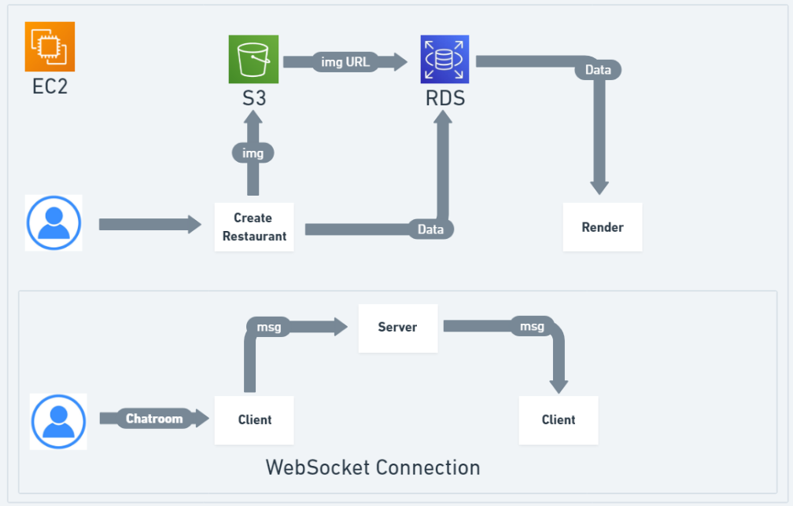
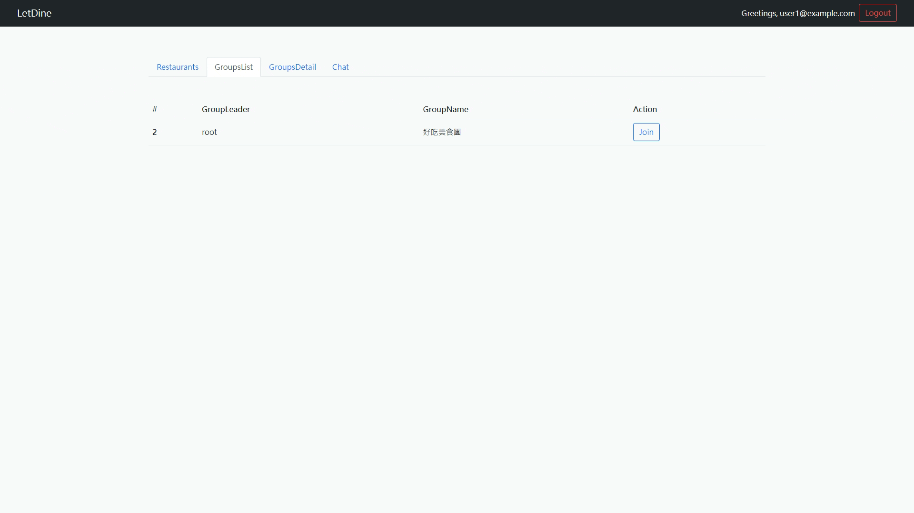

## Introduce

This application is created to facilitate food ordering. Group leaders can create their own dining groups, while users have the option to join existing groups. Additionally, they can enter a chat room to chat with everyone or chat with participants in a dining group. Hope you have a pleasant experience!

This website is built with Node.js, Express.js, WebSocket and MySQL. I've leveraged Sequelize, a Node.js ORM (Object Relational Mapping) tool, to interact with the database.The deployment is on AWS EC2, and use S3 for storage and RDS for data management.


## Architecture Diagram




## Demo




## Link

### [Link](http://ec2-35-78-203-246.ap-northeast-1.compute.amazonaws.com:3000/)


## Tech Skills

**Client**: JavaScript, HTML, CSS, Handlebars.js<br>
**Server**: Node.js, Express.js, RESTful API<br>
**Database**: MySQL<br>
**Cloud Service (AWS)**: EC2, S3, RDS<br>
**Tools**: WebSocket, Git, Passport.js


## Features

- Enhanced the efficiency of the ordering process by the concept of joining food groups, allowing everyone to simultaneously view the menu and place orders in real-time.
- Established  a chatroom feature, enabling users to receive real-time updates on meal status. Additionally, the chatroom supported instant communication for both individual and group interactions.
- Adopted the easily recognizable route structure facilitated by the RESTful API style to manage the project with over 40 routes
- Implemented user authentication with the Passport package to prevent unauthorized access to the website via URLs for users who are not logged in
- Uploaded the project to the cloud, utilizing AWS EC2 to establish the environment, and S3/RDS to store data for sharing with users
- The root administrator has the capability to perform additions, deletions, and modifications for restaurants, as well as manage user and group leader permissions.


## Usage

1.Clone the repository
```
git clone https://github.com/TheyCallMeAndyBro/LetDine.git
```

2.Move to file
```
cd LetDine
```

3.Install npm packages
```
npm install
```

4.Set up MySQL(Database)

edit environment config
```
create database restaurant;

```

5.Run migration and seeder to create database data
```
npx sequelize db:migrate;
npx sequelize db:seed:all
```

6.Launch the website 
```
npm start
```

7..Stop
```
ctrl +　ｃ
```

**Additional Note:**

Deploy image files to AWS S3 the code located in the deploy-aws branch at /src/helpers/file-helper.js


## Account

You can use the provided usernames and passwords to login:

**With admin permissions:**
- Email: root@example.com
- Password: 12345678

**Without admin permissions:**
- User1:
  - Email: user1@example.com
  - Password: 12345678
- User2:
  - Email: user2@example.com
  - Password: 12345678


or you can sign up with your own email and password.


## Future work

- Implement React for client-server, replacing Handlebars
- Utilize the Google Maps API to discover nearby restaurants
- Integrate a chatbot using OpenAI for personalized food recommendations
- Allow users to update their profits
- Enable users to comment on restaurants